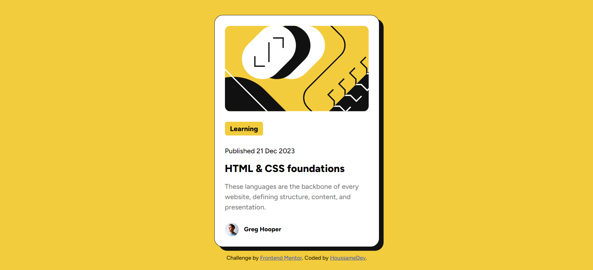

# Frontend Mentor - Blog preview card solution

This is a solution to the [Blog preview card challenge on Frontend Mentor](https://www.frontendmentor.io/challenges/blog-preview-card-ckPaj01IcS). Frontend Mentor challenges help you improve your coding skills by building realistic projects.

## Table of contents

- [Overview](#overview)
  - [The challenge](#the-challenge)
  - [Screenshot](#screenshot)
  - [Links](#links)
- [My process](#my-process)
  - [Built with](#built-with)
  - [What I learned](#what-i-learned)
  - [Continued development](#continued-development)
  - [Useful resources](#useful-resources)
- [Author](#author)

## Overview

### The challenge

Users should be able to:

- See hover and focus states for all interactive elements on the page

### Screenshot



### Links

- Solution URL: [Github](https://github.com/houssamedev/blogpreviewcard)
- Live Site URL: [BlogPreviewCard](https://blogpreviewcard-beta.vercel.app/)

## My process

### Built with

- Semantic HTML5 markup
- CSS custom properties
- Flexbox
- Mobile-first workflow

### What I learned

- How to use variable fonts (its really powerful) and @Font Face Property
- Use the default responsiveness behavior of the html document
- Responsive Design using unites like rem and % also media queries
- The Clamp propert in font is next level

To see how you can add code snippets, see below:

```css
@font-face {
  font-family: Figtree;
  src: url("./fonts/Figtree-VariableFont_wght.ttf") format("woff2-variations");
  font-weight: 500 800;
  font-stretch: 75% 125%;
  font-style: normal;
}
h1 {
  font-size: clamp(1rem, 2.5vw, 2rem);
}
button {
  background: var(--main-bg-color);
}
```

### Continued development

- Using javascript will be great in the case of hovering on the h2 tag to trigger the box-shadow shift.

### Useful resources

- [Clamp Property](https://developer.mozilla.org/en-US/docs/Web/CSS/clamp) - This helped me to make the font really fluid (responsive) when changing the screen size.

## Author

- Frontend Mentor - [@HoussameDev](https://www.frontendmentor.io/profile/houssamedev)
